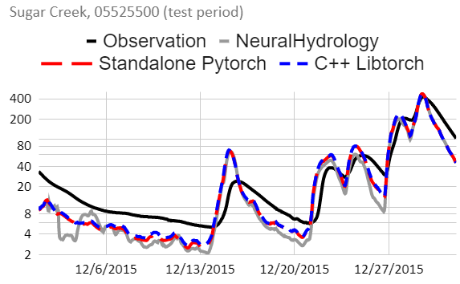

# Run a prediction from a trained NeuralHydrology model through the C++ Pytorch API

#### Gary's blog is a great reference for a simple pytorch model running with the C++ API. https://g-airborne.com/bringing-your-deep-learning-model-to-production-with-libtorch-part-1-why-libtorch/

#### NeuralHydrology python code is in the directory ./nh, but this has not been kept up with the latest NH releases. Please see github.com/neuralhydrology/neuralhydrology for the latest versions of NeuralHydrology.

#### The cudalstm from NH is the simplest version. This has been re-written with Pytorch and traced for serialization with JIT. I saved the text output as a text file called "lstm-traced.py", this has the interpreted python code which has been converted to binary in the "lstm.ptc" file. The C++ version loads in the serialized lstm.ptc to run as a functino.

#### lstn.cpp is the main file for the C++ implimentation of the lstm model. This is basically a prototyping platform, because the goal is to have this model running through the Next Generation National Water Model. The C++ code does these steps.
* load in the scaling factors for the input/output data with a function called "read_scale_parms".
* load in the data to be used in the forward pass for prediction with a function called "read_input".
* The main function loops through the data and calls the LSTM.
  * Load in the serialized lstm function "lstm.ptc" as the torch model
  * Send that model to the device (CPU or GPU)
  * Set model to evaluation mode (only running forward pass)
  * Ensure that gradients are not calculated when using torch 
  * import both forcing factors and scalers (using functions defind above). 
  * Initialize model cell states and hidden states.
  * Loop through time
    * set the inputs
    * call the model
    * split up the output between states and streamflow
  * check for errors 

#### Build and run the C++ code with the build-and-run.sh file, that uses CMakeList.txt to compile everything in the 'build' directory. And it also copies the executable out into the main directory, which should be called 'lstm_run'. The file then runs it.

#### To check that the Pytorch model is correct in the first place, before it is traced, loaded and run in C++, there are two all Python files that runs the model in the same way that we want. 
* The first is called 'lstm-python-run.py', and it has the lstm model build up from scratch to mimic the NeuralHydrology forward pass. This is basically a prototype for the C++ code that we want to run. It runs the LSTM one time step at a time, saving the weights after a warmup period.
* The second is called 'lstm-load-model-run.py' which loads in a model that was exported directly from NeuralHydrology. Note that this file requires the entire time series as input, so it actually won't really work for our purposes, but it is just for comparison.
